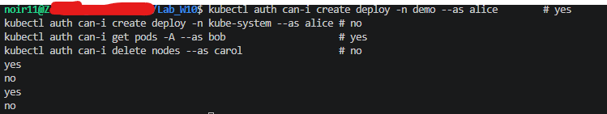
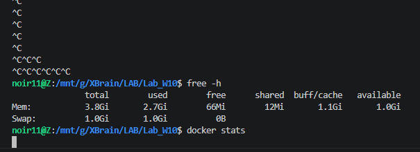

# LAB-D4-D5
Mục tiêu Lab:<br>
- Secure & Operate: RBAC + ADmin Policy
- secrets supply chain

Lab repo: https://github.com/nnc-11/Lab_W10.git

## Lab 1.1 RRAC
Mục tiêu: phân quyền 3 vai trò qua GitOps, không `kubectl apply` tay.

```text
rbac/
├── roles.yaml
└── rolebindings.yaml

argocd/apps/
└── rbac.yaml
```
Quyền cần tạo:

| User | Vai trò | Quyền |
| --- | --- | --- |
| `alice` | developer | CRUD workload như deploy/pod/service, chỉ trong namespace `demo` |
| `bob` | sre | Xem và thao tác pod toàn cụm, mọi namespace |
| `carol` | viewer | Chỉ đọc `get/list/watch`, toàn cụm |

Triển khai:

- `alice` chỉ trong 1 namespace nên dùng `Role` + `RoleBinding` ở namespace `demo`.
- `bob` và `carol` toàn cụm nên dùng `ClusterRole` + `ClusterRoleBinding`.
- Binding cho user dùng `subjects.kind: User`.
- Viewer chỉ được `get/list/watch`, không cho `create/update/delete`.
- App ArgoCD `argocd/apps/rbac.yaml` trỏ `path: rbac`.

CHECK:

```bash
kubectl auth can-i create deploy -n demo --as alice        # yes
kubectl auth can-i create deploy -n kube-system --as alice # no
kubectl auth can-i get pods -A --as bob                    # yes
kubectl auth can-i delete nodes --as carol                 # no
```
<br>

## Lab 1.2 - Gatekeeper

Mục tiêu: cài OPA Gatekeeper qua GitOps và enforce 4 luật admission. Manifest vi phạm phải bị API server reject.

4 luật cần enforce:

| # | Luật | Risk |
| --- | --- | --- |
| 1 | Cấm image tag `:latest` | F-01 |
| 2 | Bắt buộc có `resources.limits` | F-02 |
| 3 | Cấm `runAsUser: 0` | F-04 |
| 4 | Cấm `hostNetwork: true` | - |
<br>repo: https://github.com/nnc-11/Lab_W10/tree/main/gatekeeper/constraints
<br>

## Lab 1.3 Viết custom ConstraintTemplate
Chọn: Reject Deployment nếu replicas > 5

```yaml
# Chặn Deployment có replicas >5
apiVersion: templates.gatekeeper.sh/v1
kind: ConstraintTemplate
metadata:
  name: k8smaxdeploymentreplicas
  annotations:
    argocd.argoproj.io/sync-wave: "-1"
spec:
  crd:
    spec:
      names:
        kind: K8sMaxDeploymentReplicas
      validation:
        openAPIV3Schema:
          type: object
          properties:
            maxReplicas:
              type: integer
  targets:
  - target: admission.k8s.gatekeeper.sh
    rego: |
      package k8smaxdeploymentreplicas

      violation[{"msg": msg}] {
        replicas := input.review.object.spec.replicas
        max_replicas := input.parameters.maxReplicas
        replicas > max_replicas
        msg := sprintf("Deployment <%v> replicas %v exceeds max allowed %v", [input.review.object.metadata.name, replicas, max_replicas])
      }
---
apiVersion: constraints.gatekeeper.sh/v1beta1
kind: K8sMaxDeploymentReplicas
metadata:
  name: max-deployment-replicas
  annotations:
    argocd.argoproj.io/sync-wave: "0"
spec:
  enforcementAction: deny
  match:
    excludedNamespaces:
    - kube-system
    - argocd
    - argo-rollouts
    - monitoring
    - gatekeeper-system
    kinds:
    - apiGroups: ["apps"]
      kinds: ["Deployment"]
  parameters:
    maxReplicas: 5
```

Test case 1: replicas = 10 Rejected

```yaml
apiVersion: apps/v1
kind: Deployment
metadata:
  name: bad-deploy
spec:
  replicas: 10
  selector:
    matchLabels:
      app: test
  template:
    metadata:
      labels:
        app: test
    spec:
      containers:
      - name: nginx
        image: nginx:1.27
```

Test case 2: replicas = 3 Passed

```yaml
apiVersion: apps/v1
kind: Deployment
metadata:
  name: good-deploy
spec:
  replicas: 3
  selector:
    matchLabels:
      app: test
  template:
    metadata:
      labels:
        app: test
    spec:
      containers:
      - name: nginx
        image: nginx:1.27
```
## Lab 2.1 ESO
Mục tiêu: rotate secret không restart pod
- App đang đọc DB password từ Secret plaintext. Chuyển sang AWS Secrets Manager + ESO tự sync → đổi giá trị trên AWS, K8s Secret cập nhật < 60s, pod không restart.
- Lưu ý: AWS credentials tạo bằng kubectl create secret — KHÔNG commit vào git.

Check:
- Đổi value trên AWS → kubectl get secret -o jsonpath. đổi theo < refreshInterval
- kubectl get pod sau khi rotate. AGE không đổi (no restart)
- grep -ri password trong repo. không có secret thật.

OutPut:
- secret tự đồng bộ trong < 60s, pod không restart, và repo sạch (không lộ credentials).

## Lab 2.2  Trivy + Cosign
Đề bài: scan + ký + verify image -> Cluster chỉ được chạy image đã scan sạch CVE và đã ký.

Check list task:

- Trivy trong CI: fail pipeline nếu có CVE HIGH/CRITICAL
- Cosign: ký image sau khi build
- Admission verify: image chưa ký → reject

Check:

- Push image chứa CVE HIGH: CI đỏ
- Deploy image chưa ký: adminssion reject 
- Deploy image đã ký (từ CI): Passed

OutPut:

- Cả 3 đúng. CVE mà vendor chưa fix. -> không block mãi ghi exception ADR có thời hạn 

## Technical limitaion + mitigation plan
### Hạn chế môi trường triển khai

Trong quá trình thực hiện lab, hệ thống Kubernetes được triển khai trên môi trường local (máy cá nhân) với giới hạn về tài nguyên (RAM/CPU).

Do đó:
- Việc chạy đồng thời ArgoCD, Gatekeeper và các workload test có thể gây thiếu bộ nhớ
- Một số thành phần có thể hoạt động không ổn định khi tải tăng

<br>

### Phương án khắc phục

1. Môi trường hiện tại (Local): 

- Sử dụng cluster nhẹ (kind/minikube)
- Giảm tải tài nguyên tối đa có thể
- Chỉ triển khai các thành phần cần thiết để kiểm tra policy

Đã test, cũng đã giảm replica :1  nhưng vẫn không khắc phục được.

2. Phương án mở rộng (EC2 - đề xuất)

- Triển khai Kubernetes cluster trên AWS EC2 (kubeadm hoặc k3s)
- Cấp phát tài nguyên phù hợp để chạy đầy đủ:
  - ArgoCD
  - Gatekeeper Controller
  - Các workload kiểm thử
- Đảm bảo hệ thống ổn định hơn cho GitOps và admission control

Đang lên kế hoạch triển khai lại (chưa thực hiện kịp trong time làm lab)


