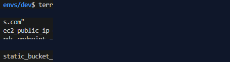
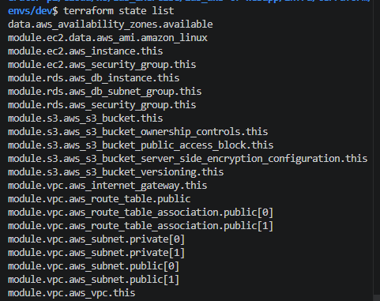
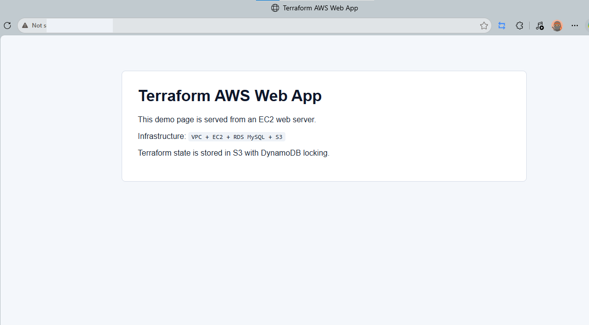
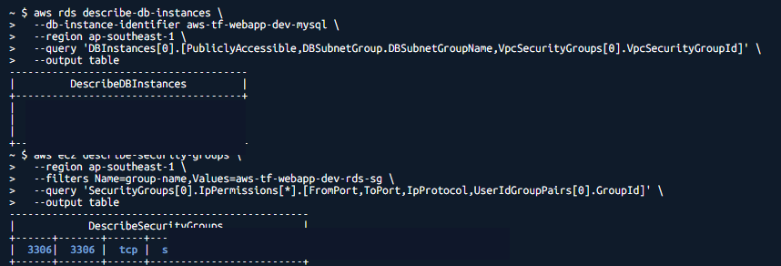
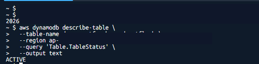

# Evidence

## 1. Terraform apply

- `terraform output` 
- `terraform state list` 

## 2. Web EC2

- Trình duyệt truy cập được web demo qua EC2 public IP/DNS.

## 3. RDS private

- RDS `Publicly accessible = No`.
- Security Group RDS chỉ cho phép port `3306` từ Security Group của EC2.

## 4. S3 và state backend

- S3 static bucket tồn tại.
- S3 backend có file `dev/aws-tf-webapp/terraform.tfstate`.
- DynamoDB lock table tồn tại.

## Destroy lab

- Destroy dev resources.
- Destroy bootstrap resources.

## Security note

- Không commit `terraform.tfvars`, `terraform.tfstate`, `.terraform/`, access key, secret key, DB password.
- Evidence sử dụng ảnh đã redact một phần thông tin định danh để tránh công khai tài nguyên AWS trên GitHub. Nội dung kiểm tra chính vẫn được giữ lại: resource tồn tại, RDS không public, Security Group chỉ mở port cần thiết, và backend state hoạt động.
