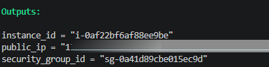
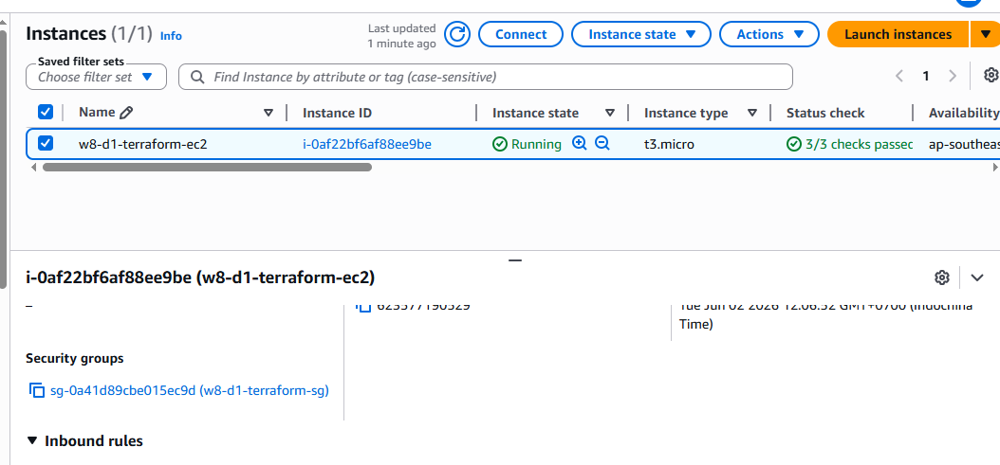
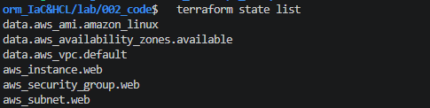

# 003 - Evidence

Evidence cho `001_requirements.md` - Lab 01: Deploy EC2 bang Terraform.

## Mapping voi yeu cau

| Yeu cau trong `001_requirements.md` | Evidence |
| --- | --- |
| Tao EC2 instance bang Terraform | EC2 instance `w8-d1-terraform-ec2` da duoc tao va o trang thai running tren AWS Console. |
| Tao Security Group cho phep SSH | Security Group `w8-d1-terraform-sg` duoc gan voi EC2 instance. |
| Su dung Variables va Outputs | Terraform hien thi outputs gom `instance_id` va `security_group_id`; `public_ip` |
| Hieu cach Terraform quan ly State | Lenh `terraform state list` hien thi cac resource Terraform dang quan ly. |
| Xoa toan bo tai nguyen sau khi hoan thanh | Terraform destroy hoan thanh voi ket qua `3 destroyed`. |

## Evidence 01 - Terraform apply outputs

Mo ta: Ket qua output sau khi Terraform apply thanh cong. Gia tri `public_ip` (giá trị ip public tạm che nhé).

## Evidence 02 - EC2 instance va Security Group tren AWS

Mo ta: EC2 instance duoc tao bang Terraform, dang running, instance type `t3.micro`, va co Security Group `w8-d1-terraform-sg` duoc gan vao instance.

## Evidence 03 - Terraform State

Mo ta: Terraform state dang quan ly cac data source va resource cua lab, bao gom AMI, Availability Zones, default VPC, EC2 instance, Security Group va subnet.

## Evidence 04 - Terraform destroy

Mo ta: Tai nguyen cua lab da duoc xoa sau khi hoan thanh, Terraform bao `Destroy complete`.

