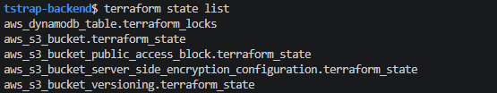
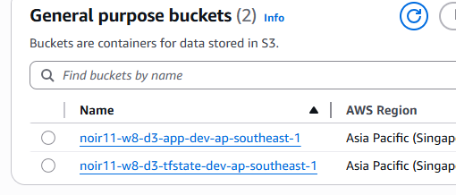
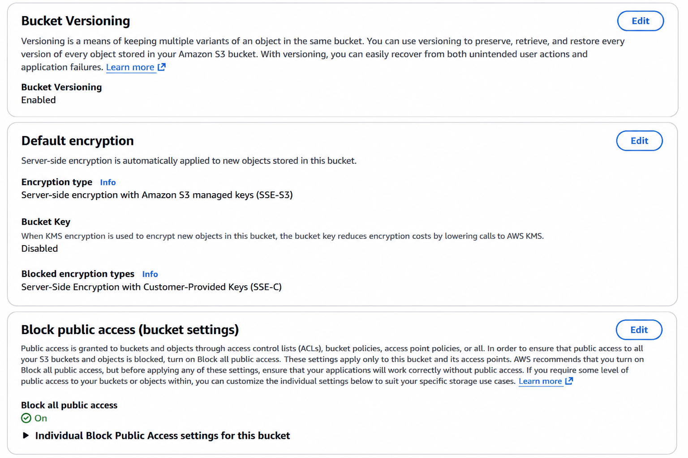
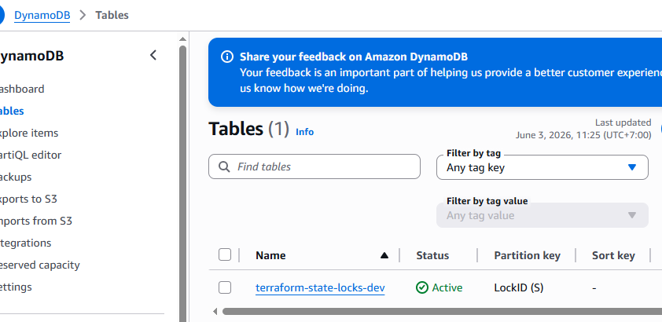
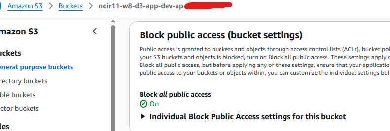

# Lab Evidence

## Evidence Requirements

### 1. Terraform Remote State List

Chứng minh Terraform đang quản lý resource qua state.

Command:

```bash
terraform state list
```

Evidence:



### 2. S3 State Object

Chứng minh state của môi trường dev đã được lưu trên S3 remote backend.

Required evidence:

* AWS Console S3 state bucket có object `w8/d3/dev/terraform.tfstate`.

Evidence:




### 3. S3 State Bucket Settings

Chứng minh state bucket được cấu hình an toàn.

Required evidence:

* Versioning enabled.
* Encryption enabled.
* Block public access enabled.

Evidence:



### 4. DynamoDB Lock Table

Chứng minh backend có lock table đúng yêu cầu.

Required evidence:

* AWS Console DynamoDB table có partition key `LockID`.

Evidence:



### 5. S3 App Bucket

Chứng minh app bucket demo được tạo và không public.

Required evidence:

* AWS Console app bucket private/block public access.

Evidence:



### 6. Cleanup Sau Khi Hoàn Thành Lab

Destroy dev resource trước:

```bash
cd lab/002_code/envs/dev
TF_PLUGIN_CACHE_DIR=/tmp/tf-plugin-cache terraform destroy
```

Sau đó mới cân nhắc destroy backend:

```bash
cd ../../bootstrap-backend
TF_PLUGIN_CACHE_DIR=/tmp/tf-plugin-cache terraform destroy
```

Không destroy backend nếu vẫn cần giữ state trong S3.

Lưu ý:

* State bucket bật versioning, nên object `w8/d3/dev/terraform.tfstate` có thể còn version cũ sau khi destroy dev.
* Nếu muốn xóa sạch backend bucket, cần xóa các object versions trong state bucket trước, rồi mới destroy backend.
* Kiểm tra cleanup bằng AWS Console hoặc `aws s3api head-bucket`; kết quả `404 Not Found` nghĩa là bucket đã bị xóa.

## ADR

xem: knowledge/001_overview.md (## 7. ADR)
