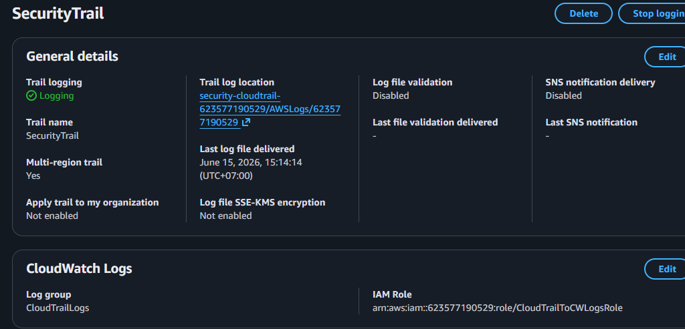
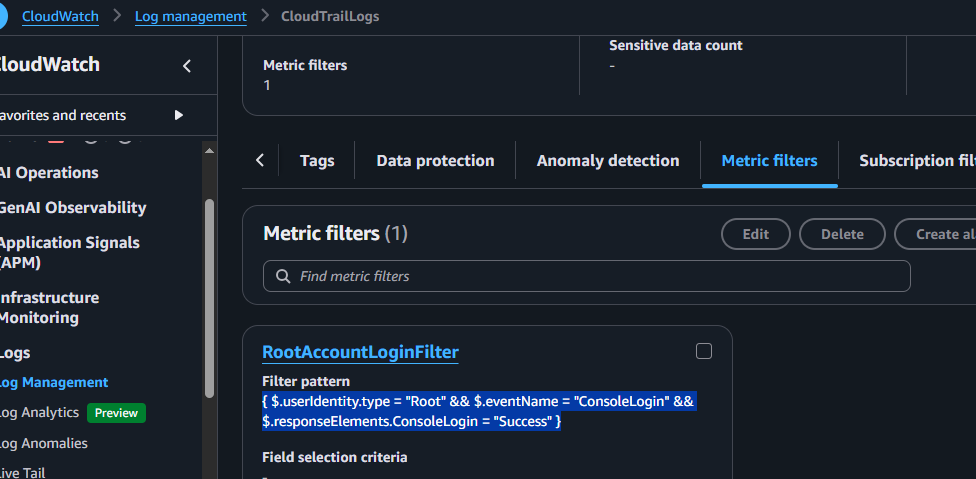
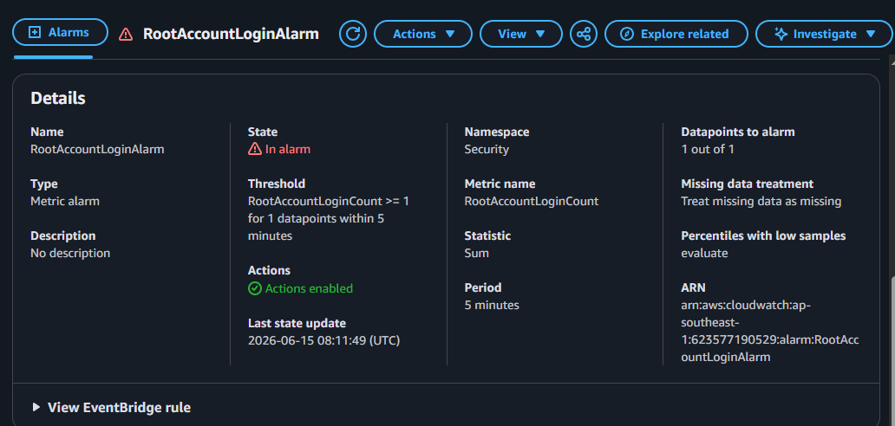
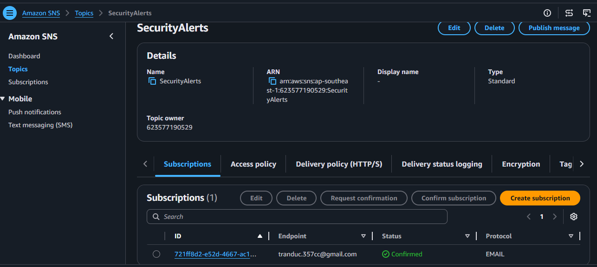
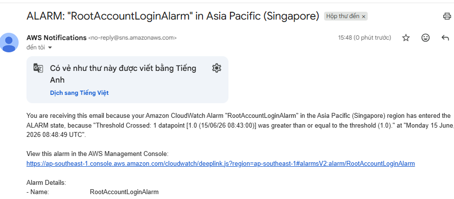

# Hands-On: Alert on AWS Root Account Login

**Security Best Practice:** The root account should almost never be used. Alert immediately if it is!

---

## Overview

This lab demonstrates how to set up automated alerts when the AWS root account is used to log in. It uses CloudTrail, CloudWatch, and SNS to detect and notify on root account console logins.

---

## Architecture

1. **CloudTrail** captures all API calls (including root console logins)
2. **CloudTrail logs** are sent to CloudWatch Logs
3. **Metric Filter** detects root account login events
4. **CloudWatch Alarm** triggers when root login is detected
5. **SNS** sends email notification to security team

---

## Lab Components

### 1. CloudTrail Send Logs to CloudWatch

CloudTrail is configured to capture all events and forward them to CloudWatch Logs for real-time analysis.



**Key Details:**
- Trail Name: `SecurityTrail`
- Multi-Region: Enabled
- CloudWatch Logs Group: `CloudTrailLogs`

---

### 2. CloudWatch Metric Filter

A metric filter detects when a root user successfully logs into the AWS Console.



**Filter Pattern:**
```
{ $.userIdentity.type = "Root" && $.eventName = "ConsoleLogin" && $.responseElements.ConsoleLogin = "Success" }
```

**Metric:**
- Namespace: `Security`
- Metric Name: `RootAccountLoginCount`
- Value: `1` (incremented for each root login)

---

### 3. CloudWatch Alarm Configuration

An alarm monitors the metric and triggers when a root login is detected.



**Alarm Settings:**
- Threshold: `1` (triggers on first root login)
- Period: `300 seconds` (5 minutes)
- Evaluation Periods: `1`
- Action: Send SNS notification

---

### 4. Alert on AWS Root Account Login

When root account logs in, an alert email is sent to the security team.

**Event in CloudTrail:**


**Alarm Trigger & Email Notification:**


---
## Testing

1. Confirm the SNS email subscription (check email inbox)
2. Log in to AWS Console using root account
3. Wait 5-10 minutes for metrics to populate
4. Verify alarm triggers and email notification arrives
