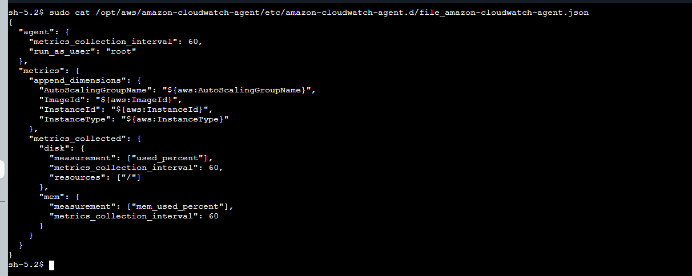
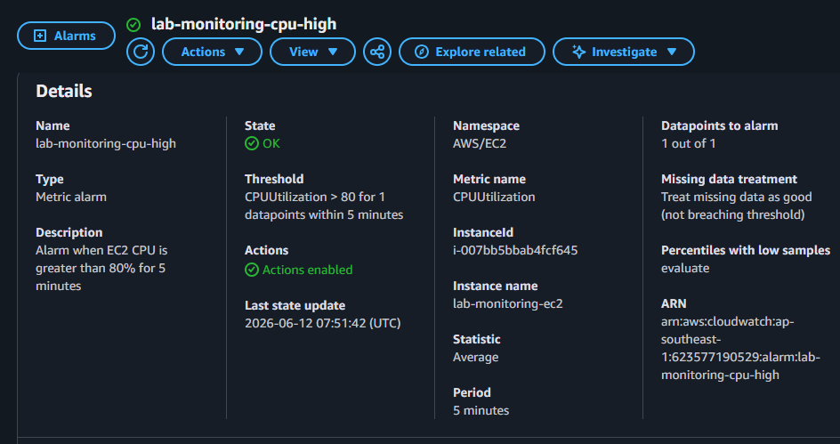
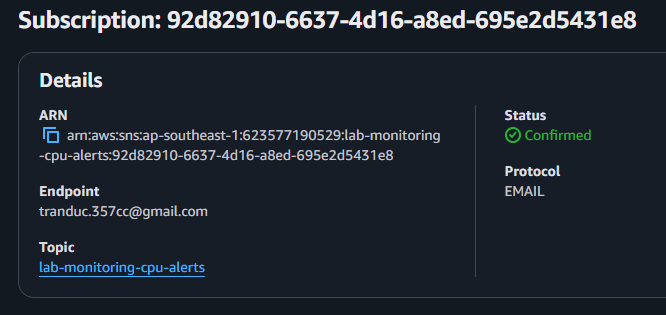
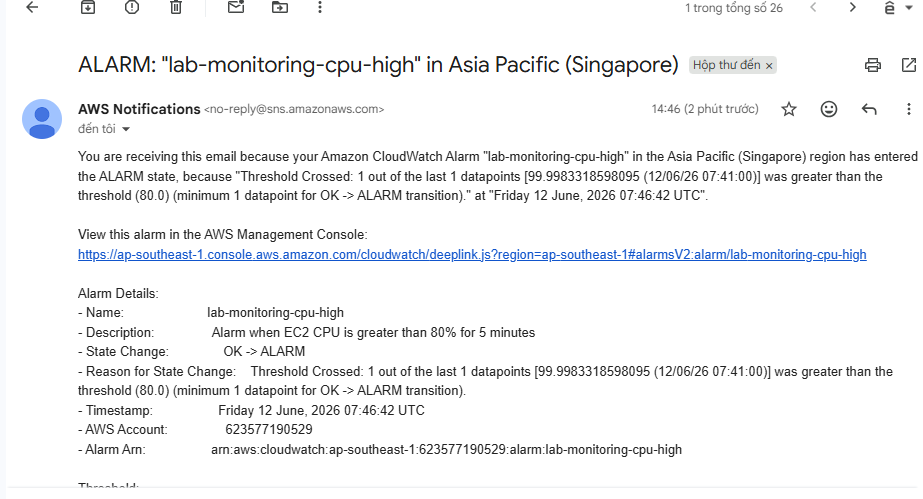

# Lab Monitoring: CloudWatch Agent and CPU Alarm via SNS

# Evidence LAB (12/06)

## Lab 1: Installing the CloudWatch Agent on EC2

- File cấu hình CloudWatch Agent đã có trên EC2:

- CloudWatch đã nhận metric từ EC2:

## Lab 2: CPU Alarm -> Email Alert via SNS

- Metric CPU tăng cao khi chạy stress test:

- alarm config:

- SNS config to email.

- CloudWatch Alarm đã chuyển trạng thái và gửi cảnh báo:

## Comment

Lab đã hoàn thành: CloudWatch Agent chạy trên EC2, CloudWatch nhận được metric, CPU alarm vượt ngưỡng 80% và email alert qua SNS đã được gửi thành công.
